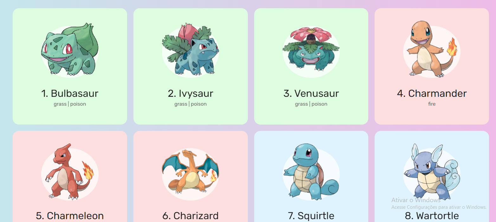

<h1 align="center"> Pokedex - Primeira Geração </h1>

 Imagem do Projeto 

<a href="https://geovannecallegaro.github.io/pokedex-js/"> Link para o projeto </a>

##

<h2> Sobre o projeto </h2> 

 É um site construído utilizando apenas html, css e javascript. Para ter acesso aos dados dos pokemons, foi utilizado requisições a api pública <a href="https://pokeapi.co/">POKEAPI</a> 

##

<h2> O que pude aprender com o projeto </h2>

<ul>
    <li> Responsividade com media queries </li>
    <li> Consumo de api's com Javascript </li>
    <li> Manipulação da DOM com Javascript </li>
    <li> Como estruturar uma página do tipo SPA </li>
</ul>

